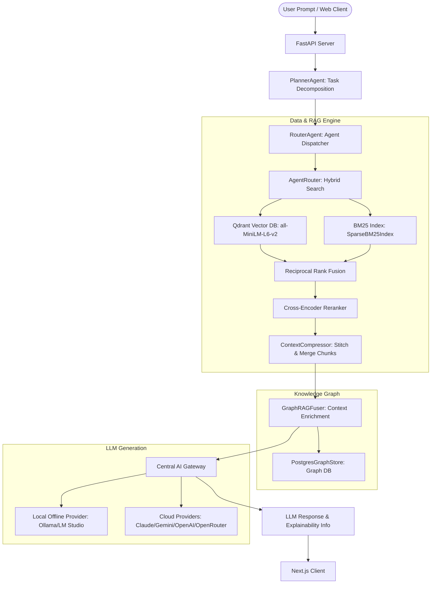

# Architecture Overview

NORAY is an enterprise-grade AI Operating System designed around a modular, hybrid RAG engine and a multi-agent orchestration framework.

## Core Architecture

## Component Details

### 1. Unified AI Gateway (`noray/gateway`)
The AI Gateway abstracts away all LLM provider specifics. It routes requests based on constraints (e.g., minimum context window, JSON support, cost limits) and implements a robust fallback chain (e.g., Anthropic -> OpenAI -> Local Qwen). 

### 2. Multi-Agent Orchestration
Tasks are broken down by a `PlannerAgent` into a Directed Acyclic Graph (DAG), and executed concurrently by the `RouterAgent` and domain-specific agents (Career, Scholarship, Upskill).

### 3. Model Context Protocol (MCP)
NORAY acts as an MCP Client, enabling agents to dynamically discover and use external tools (Filesystem, Terminal, SQLite, Git) securely.

### 4. Hybrid Search & Graph RAG
NORAY merges dense vector search (Qdrant), sparse keyword search (BM25), and graph traversal (PostgreSQL). Results are fused via Reciprocal Rank Fusion (RRF) and enriched with explicit entity relationships.
