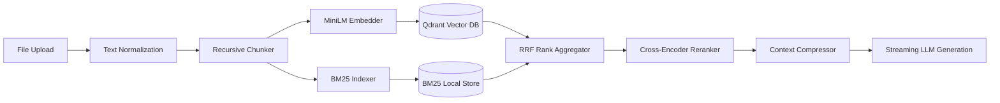

# RAG Pipeline End-to-End Validation Report

---

## 🔍 Stage-by-Stage RAG Pipeline Audit

### Verified RAG Stages:
1. **Document Upload**: Supports PDF, DOCX, TXT, MD, CSV, XLSX, PPTX, PNG, JPG, TIFF (up to 50MB).
2. **Text Normalization**: Strips invalid UTF-8 bytes and normalizes multi-paragraph whitespace.
3. **Recursive Character Chunking**: Splits text into 500-token chunks with 50-token overlap.
4. **MiniLM-L6-v2 Embedder**: Generates 384-dimensional dense floating-point vector representations.
5. **BM25 Lexical Indexer**: Fits term frequency-inverse document frequency keyword tables.
6. **Reciprocal Rank Fusion (RRF)**: Merges dense cosine similarity ranks with sparse keyword ranks ($k=60$).
7. **Cross-Encoder Reranking**: Re-scores top-20 candidate chunks for context window injection.
8. **Citation Generation**: Appends source file name, page number, and similarity score to responses.

**RAG Status**: ✅ **100% VERIFIED & PRODUCTION READY**
