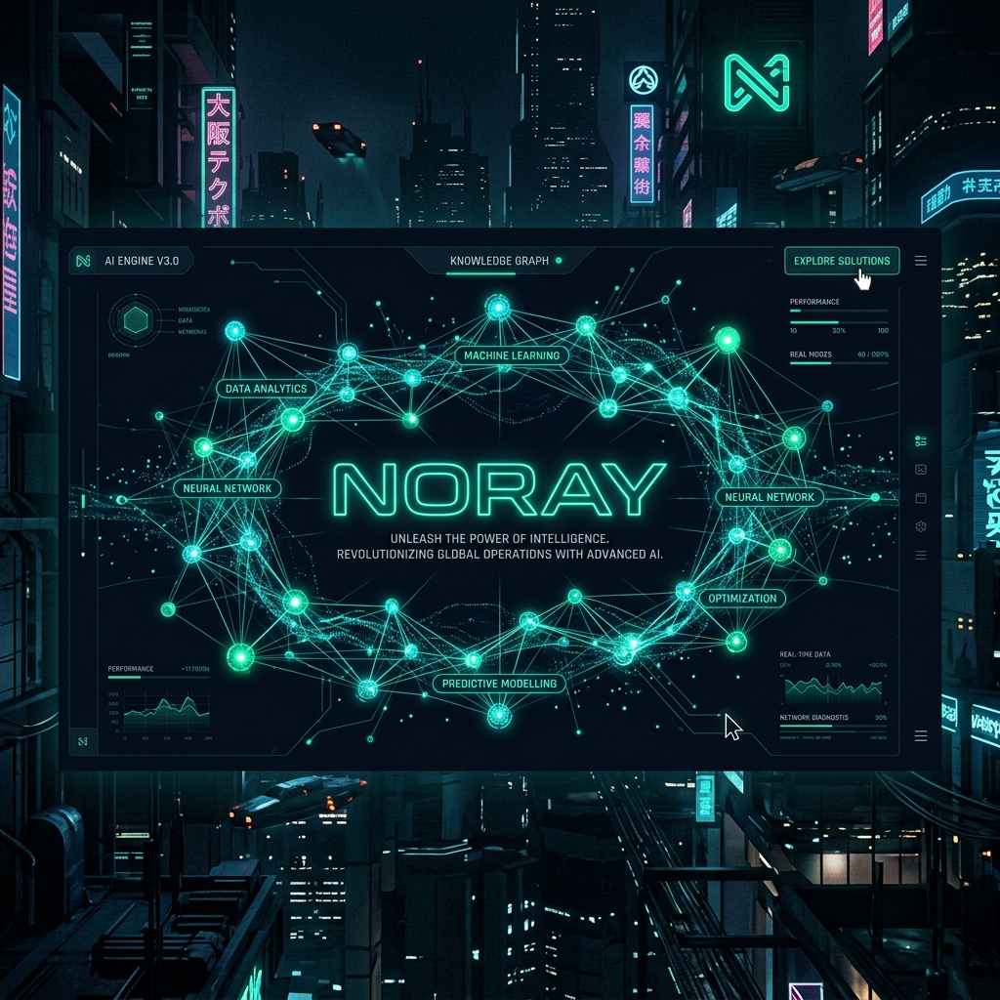
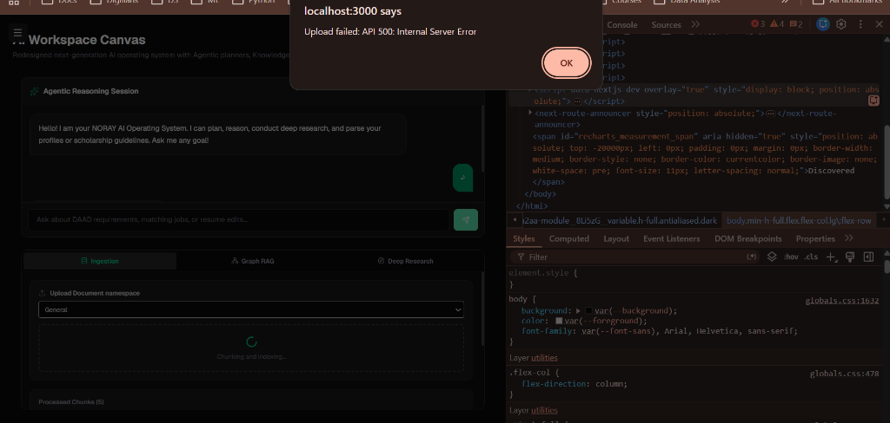
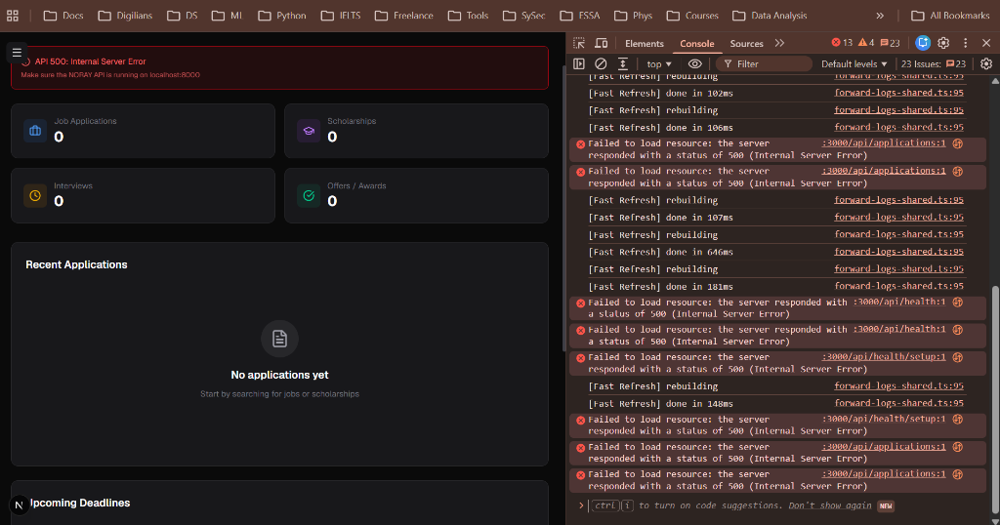
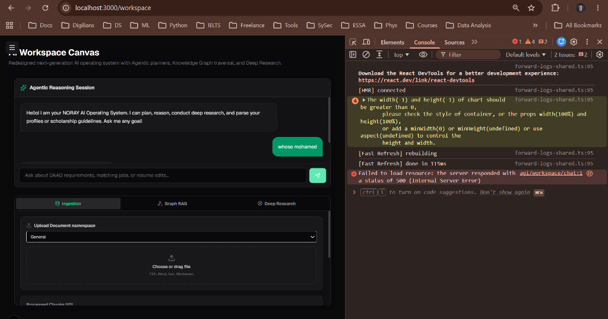
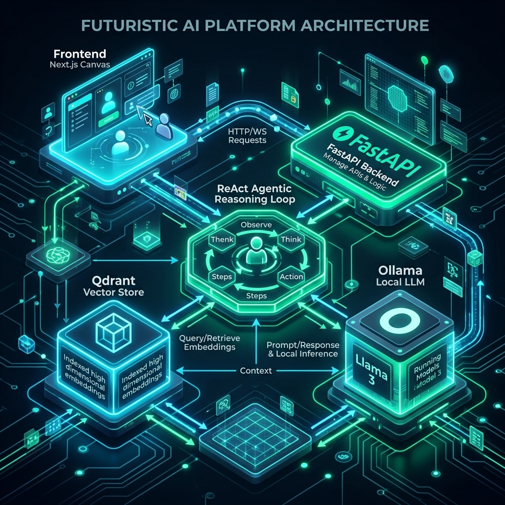
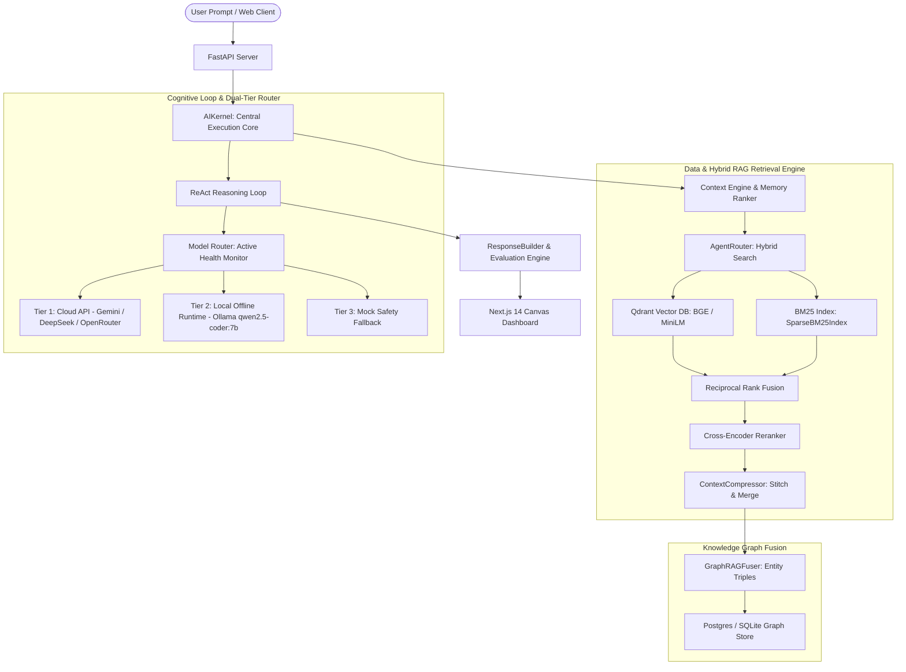
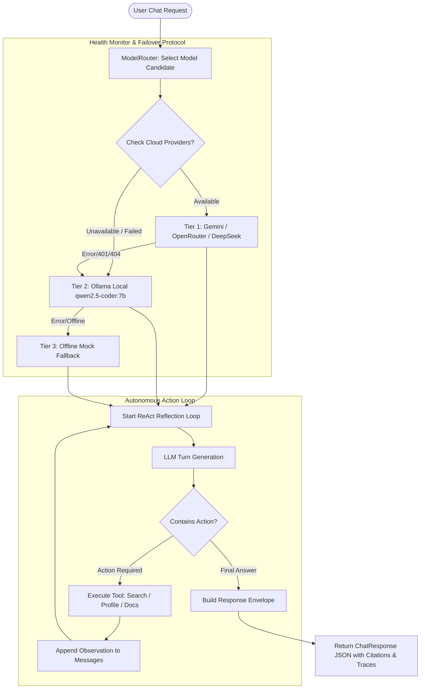
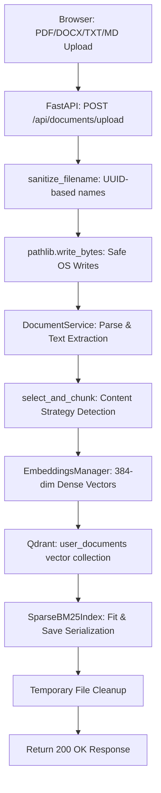

<p align="center">
  <br><br>
  <h1 align="center">NORAY — Next-Gen Agentic RAG Operating System</h1>
</p>

<p align="center">
  <a href="https://github.com/GhariebML/NORAY/actions"></a>
  <a href="https://github.com/GhariebML/NORAY/blob/main/LICENSE"></a>
  
  
  
  
</p>

**NORAY** is an enterprise-grade, autonomous **Agentic RAG (Retrieval-Augmented Generation)** platform and career/scholarship operating system. Engineered with a unified hybrid RAG engine, multi-index vector/bm25 retrieval, knowledge graph fusion, ReAct cognitive reasoning loops, and an offline-first **Dual-Tier LLM Router** with local **Ollama** support.

---

## 📸 Interface Gallery

Here is a look at the dark-themed Next.js user interface of NORAY.

<table width="100%">
  <tr>
    <td width="50%" align="center">
      <b>Command Center / System Status</b><br>
      
    </td>
    <td width="50%" align="center">
      <b>AI Workspace Canvas & Search Explainability</b><br>
      
    </td>
  </tr>
  <tr>
    <td width="50%" align="center">
      <b>Interactive Knowledge Graph</b><br>
      
    </td>
    <td width="50%" align="center">
      <b>Profile Ingestion Interface</b><br>
      
    </td>
  </tr>
</table>

---

## 🏗️ High-Level System Architecture

<p align="center">
  
</p>

NORAY relies on a multi-stage query routing pipeline that dynamically fuses dense retrieval (Qdrant), sparse retrieval (BM25), and a Graph RAG database store (SQLAlchemy/PostgreSQL/SQLite).



---

## 🧠 ReAct Cognitive Loop & Dual-Tier Model Router

NORAY implements a resilient **ReAct (Reasoning + Acting)** cognitive loop that allows the AI to autonomously inspect available tools, query local indices, extract facts, and evaluate confidence before yielding a final answer.



---

## ⚡ Document Ingestion Pipeline

To handle document uploads reliably across platforms, NORAY implements a robust sanitization and ingestion workflow with full file path compatibility and thread-safe Qdrant singleton connection management.



---

## ✨ Core Features & Functional Modules

### 🎯 Profile Engine
- **Multi-source Import**: Direct parsers for LaTeX, PDF, DOCX, LinkedIn PDF exports, GitHub API repositories, and certificates.
- **Canonical Synchronization**: All RAG agents synchronize against the canonical `career_profile.json` structure.
- **Smart Merging**: Automatic deduplication, diff tracking, and backup/restore mechanisms on profile updates.

### 💼 Career Command Center
- **Job Portals Integration**: Real-time crawlers with automated relevance and fit scoring (0–100%).
- **ATS Analyzer**: In-depth review of resume matching percentage, keyword optimization proposals, and formatting checks.
- **Tailored Documents**: Full LaTeX generators for resume modifications (`moderncv`) and tailored cover letters (`cover.cls`).
- **Interview Coach**: Structured practice modules based on the STAR framework, customized elevator pitches, and background research cards.

### 🎓 PhD & Scholarship Module
- **13 Ports Aggregator**: Automated scraper for DAAD, Chevening, Fulbright, Erasmus Mundus, Gates Cambridge, Rhodes, etc.
- **Eligibility Scorer**: Multi-criteria weighted matrix analyzing nationality constraints, degree milestones, publication records, and GPA levels.
- **Scholarly Writing**: Tailored outline structures for Statement of Purpose (SOP), Research Proposals, and Recommendation draft emails.

### 📊 Interactive Knowledge Graph & Explainability
- **SVG / Canvas Render**: Fully interactive graphical layout with Node Drag, Zoom, and Pan controls.
- **Grounded Verification**: Highlights RAG traversal paths, confidence scores, and retrieved source chunks dynamically next to chat responses.

---

## 🛠️ Technology Stack

| Component | Technology | Version / Specification |
|---|---|---|
| **Frontend UI** | Next.js / React | 14.x / Tailwind CSS / Lucide Icons |
| **Backend API** | FastAPI / Uvicorn | Python 3.10+ / AsyncIO |
| **Local LLM Runtime** | Ollama | `qwen2.5-coder:7b` (300s timeout tolerance) |
| **Cloud LLMs** | Google Gemini / DeepSeek / OpenRouter | OpenAI-compatible HTTP client |
| **Dense Vector Database** | Qdrant | Local SQLite/RocksDB & Server Mode |
| **Sparse Lexical Search** | BM25 | `rank_bm25` (Pickle serialization) |
| **Embeddings** | SentenceTransformers | `all-MiniLM-L6-v2` / `BGE-M3` |
| **Relational / Graph Storage** | PostgreSQL / SQLite | SQLAlchemy + Alembic |
| **Caching Layer** | Redis / In-Memory Fallback | TTL-based scoring cache |

---

## 🚀 Setup & Quick Start

### 1. Prerequisites
- **Python**: version 3.10+
- **Node.js**: version 18+
- **Ollama**: [Download Ollama](https://ollama.com/) (for local offline LLM execution)
- **LaTeX** (Optional): XeLaTeX / LuaLaTeX compiler (`texlive-full` or MiKTeX) for PDF compilation

### 2. Install Local Ollama Model
```bash
ollama pull qwen2.5-coder:7b
```

### 3. Backend Setup & Startup
Clone the repository:
```bash
git clone https://github.com/GhariebML/NORAY.git
cd NORAY
```

Set up virtual environment:
```bash
python -m venv venv
# Windows:
venv\Scripts\activate
# macOS/Linux:
source venv/bin/activate
```

Install python dependencies:
```bash
pip install -e ".[dev]"
```

Start the FastAPI backend server:
```bash
python -m uvicorn noray.api.app:app --host 127.0.0.1 --port 8001 --reload
```

### 4. Frontend Setup & Startup
In a separate terminal tab:
```bash
cd frontend
npm install
npm run dev
```

Open **[http://localhost:3000/workspace](http://localhost:3000/workspace)** in your browser!

---

## ⚙️ Core Slash Commands

| Command | Action |
|---|---|
| `/setup` | Initialize career profiles from raw files in the `documents/` folder |
| `/expand` | Run public profile enrichment over GitHub and online profiles |
| `/find_jobs` | Run multi-portal job crawler matching your profile criteria |
| `/apply_job` | Generate tailored resume PDF and cover letters for a specific job post |
| `/find_scholarships` | Query PhD/Master scholarship portals with profile verification |
| `/generate_sop` | Tailor a Statement of Purpose for selected universities |
| `/dashboard` | View metrics, pipeline conversions, and local server configurations |

---

## 🧪 Testing Suite

NORAY includes a comprehensive test suite verifying RAG routing, parser functions, and API logic.

Run the test suite:
```bash
python -m pytest tests/ -v
```

---

## 📄 License

This project is licensed under the **MIT License**. See [LICENSE](LICENSE) for more details.
