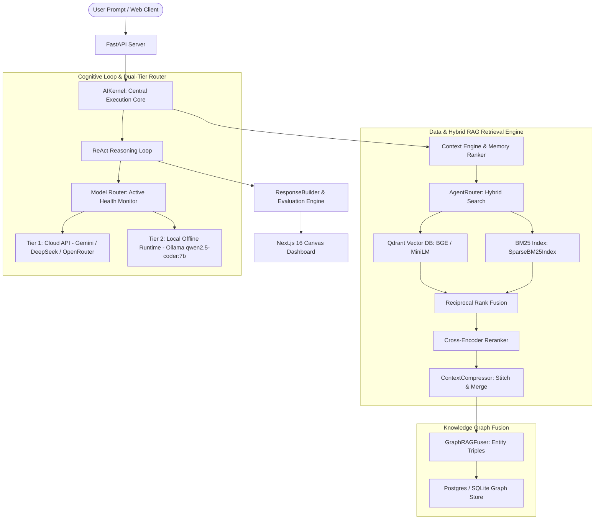

<p align="center">
  <br><br>
  <h1 align="center">NORAY — Enterprise Agentic RAG Operating System</h1>
</p>

<p align="center">
  <a href="https://github.com/GhariebML/NORAY/actions"></a>
  <a href="https://github.com/GhariebML/NORAY/blob/main/LICENSE"></a>
  
  
  
  
</p>

**NORAY** is an enterprise-grade, autonomous **Agentic RAG (Retrieval-Augmented Generation)** platform and career/scholarship operating system. Engineered with a unified hybrid RAG engine, multi-index vector/BM25 retrieval, knowledge graph fusion, ReAct cognitive reasoning loops, and a resilient dual-deployment strategy.

---

## 📸 System Gallery & Screenshots

<table width="100%">
  <tr>
    <td width="50%" align="center">
      <b>Command Center Dashboard</b><br>
      
    </td>
    <td width="50%" align="center">
      <b>AI Workspace Canvas & Explainability</b><br>
      
    </td>
  </tr>
  <tr>
    <td width="50%" align="center">
      <b>Interactive Knowledge Graph</b><br>
      
    </td>
    <td width="50%" align="center">
      <b>Job Search & Fit Evaluator</b><br>
      
    </td>
  </tr>
  <tr>
    <td width="50%" align="center">
      <b>PhD & Scholarship Engine</b><br>
      
    </td>
    <td width="50%" align="center">
      <b>Telemetry & Diagnostics</b><br>
      
    </td>
  </tr>
</table>

---

## 🎨 Dual Deployment Architecture

NORAY supports two distinct execution profiles:

### 1. Enterprise Production Deployment
- **Frontend**: Next.js 16 App Router UI (TypeScript, Tailwind CSS).
- **Backend**: FastAPI REST Server (AsyncIO, Pydantic).
- **Databases**: PostgreSQL (Relational Data), Redis (Caching & Job Tracking), Qdrant (Dense Vector Indexing).
- **Orchestration**: Fully dockerized multi-stage container deployment.

### 2. Academic Submission Demo
- **Interface**: Lightweight Streamlit App dashboard under `/academic_demo`.
- **Backend Connection**: Direct REST client communicating with FastAPI backend routes. Zero code duplication.
- **Hosting**: Direct compatibility for Streamlit Community Cloud.

---

## 🏗️ High-Level System Architecture



---

## 📂 Codebase Directory Structure

```
NORAY-main/
├── academic_demo/            # Lightweight Streamlit Academic RAG Demo
│   ├── components/           # API REST client & UI helper utilities
│   ├── pages/                # Multi-page Streamlit modules (Upload, Ask, Pipeline, Info)
│   ├── requirements.txt      # Minimal Streamlit Cloud dependencies
│   └── streamlit_app.py      # Entry point for Streamlit application
├── docs/                     # Documentation & Screenshot assets
│   └── screenshots/          # High-resolution UI screenshots
├── frontend/                 # Enterprise Next.js 16 Workspace Dashboard
│   ├── src/                  # App router, components, stores, & hooks
│   └── Dockerfile            # Multi-stage standalone node build
├── noray/                    # Core Python Package & AI Engine
│   ├── api/                  # FastAPI routes, schemas, and app initializer
│   ├── intelligence/         # AIKernel, ReAct reasoning, & DI container
│   ├── rag/                  # Hybrid retriever, Qdrant store, BM25, & reranker
│   └── services/             # Document ingestion & career services
├── SUBMISSION_PACKAGE/       # Academic course submission materials & guides
├── tests/                    # Pytest unit & integration test suite (96 tests)
├── docker-compose.yml        # Multi-service production orchestration
├── Dockerfile                # Multi-stage backend Docker image
├── pyproject.toml            # Package configuration
└── README.md                 # Project landing page
```

---

## 🛠️ Technology Stack Matrix

| Component | Technology | Version / Details |
|---|---|---|
| **Frontend UI** | Next.js / React | 16.x / Standalone / Tailwind CSS |
| **Academic UI** | Streamlit | 1.30+ Emerald Dark Glass Theme |
| **Backend API** | FastAPI / Uvicorn | Python 3.10+ / AsyncIO |
| **Local LLM Runtime** | Ollama | `qwen2.5-coder:7b` |
| **Cloud LLMs** | Google Gemini / DeepSeek / OpenRouter | OpenAI-compatible HTTP client |
| **Dense Vector Database** | Qdrant | Local SQLite/RocksDB & Cloud Server Mode |
| **Sparse Lexical Search** | BM25 | `rank_bm25` (Pickle serialization) |
| **Embeddings** | SentenceTransformers | `all-MiniLM-L6-v2` / `bge-m3` |
| **Relational Storage** | PostgreSQL / SQLite | SQLAlchemy + Alembic |
| **Caching Layer** | Redis | Redis Py Async |

---

## 🚀 Installation & Quick Start

### Option 1: Local Development
1. **Launch Databases**:
   ```bash
   docker-compose up postgres qdrant redis -d
   ```
2. **Backend**:
   ```bash
   python -m venv venv
   source venv/bin/activate  # Windows: venv\Scripts\activate
   pip install -e ".[dev]"
   python -m uvicorn noray.api.app:app --host 127.0.0.1 --port 8001 --reload
   ```
3. **Frontend**:
   ```bash
   cd frontend
   npm install
   npm run dev
   ```
   Open [http://localhost:3000/workspace](http://localhost:3000/workspace).

### Option 2: Multi-Container Docker
```bash
docker-compose up --build -d
```

### Option 3: Academic Streamlit Demo
```bash
cd academic_demo
pip install -r requirements.txt
streamlit run streamlit_app.py
```
Open [http://localhost:8501](http://localhost:8501).

---

## 🗺️ Product Roadmap

- [x] **v1.0**: Core Hybrid RAG, Dual-Tier Router, Qdrant Integration, Academic Streamlit Demo.
- [ ] **v1.1**: Multimodal RAG with direct OCR chart extraction & vision models.
- [ ] **v1.2**: Decentralized Peer-to-Peer Knowledge Graph Syncing.

---

## ⚠️ Known Limitations & Mitigations

1. **Local LLM Performance**: Running local Ollama models (`qwen2.5-coder:7b`) requires 8GB+ RAM. *Mitigation*: Automated cloud API fallback when hardware is constrained.
2. **PDF Formatting**: OCR extraction on scanned multi-column papers may add whitespace artifacts. *Mitigation*: Built-in character normalizer sanitizes input strings.

---

## 📄 License & Author

- **License**: MIT License. See [LICENSE](LICENSE) for details.
- **Author**: NORAY Engineering Team (GhariebML).
- **Acknowledgements**: Inspired by Cursor, ChatGPT Projects, and NotebookLM.
