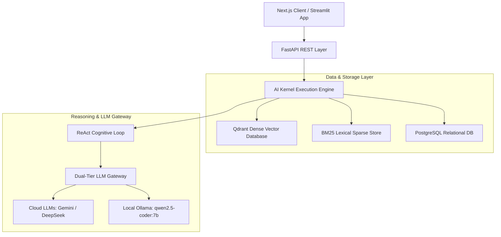

# System Architecture & Technical Specifications

---

## 🏗️ Architectural Flow Overview

---

## ⚙️ Module Responsibilities

1. **FastAPI Application Layer (`noray/api`)**: Exposes REST endpoints (`/api/documents`, `/api/workspace/chat`, `/api/health`, `/api/system/ingestion-diagnostics`). Handles Pydantic validation and CORS headers.
2. **Hybrid RAG Core (`noray/rag`)**: Implements dual vector/BM25 retrieval, Reciprocal Rank Fusion, cross-encoder reranking, and context compression.
3. **AI Gateway (`noray/gateway`)**: Manages model routing, health probes, and automatic fallback from cloud APIs to local Ollama runtimes.
