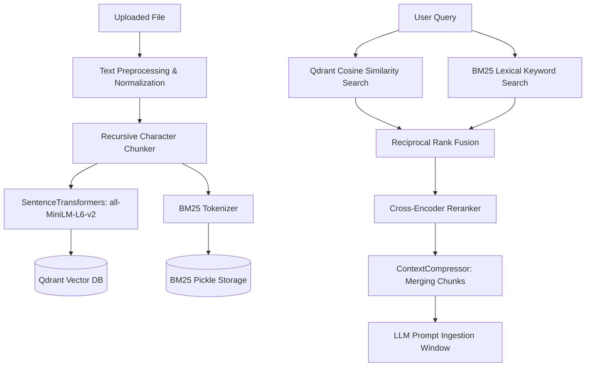

# Hybrid RAG Pipeline Technical Deep-Dive

---

## 🔍 Ingestion & Retrieval Workflow

---

## 📐 Mathematical Formulation

### Reciprocal Rank Fusion (RRF)
Given document set $D$ and rank positions $R_m(d)$ from retriever engines $m \in \{Dense, Sparse\}$:

$$RRF\_Score(d \in D) = \sum_{m \in M} \frac{1}{k + R_m(d)}$$

Where constant $k = 60$. RRF balances high-precision vector matches with exact lexical keyword hits.
