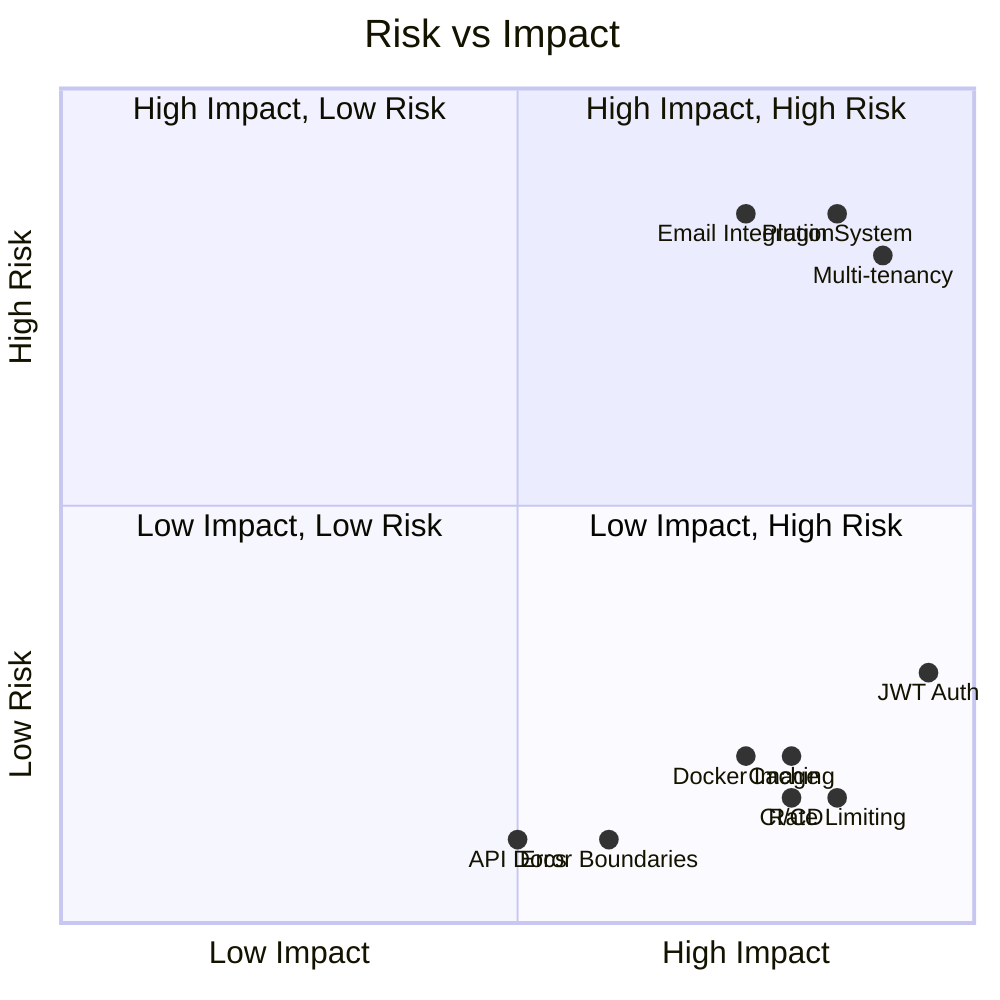
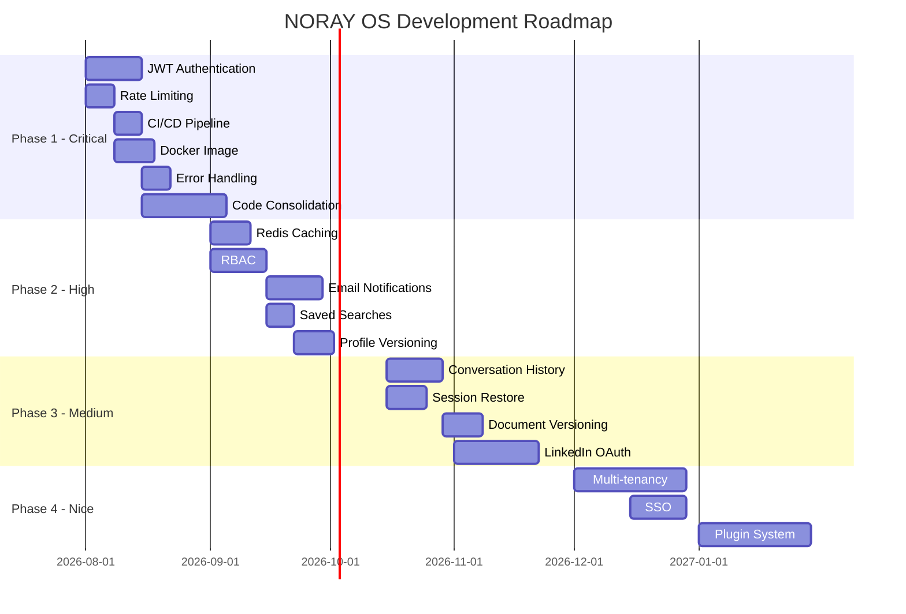

# NORAY OS — Prioritized Roadmap

**Audit Date:** July 2026

---

## Phase 1: Critical (4-6 weeks)

| # | Item | Complexity | Dependencies | Risk | Impact |
|---|------|------------|-------------|------|--------|
| 1.1 | JWT Authentication | Medium | User model, password hashing | Low | Unlocks all other security |
| 1.2 | API Rate Limiting | Low | Redis | Low | Prevents abuse, controls costs |
| 1.3 | CI/CD Pipeline | Low | GitHub Actions | Low | Automated quality gates |
| 1.4 | Docker Production Image | Medium | Multi-stage Dockerfile | Low | Deployable artifact |
| 1.5 | Error Handling Unification | Low | None | Low | Consistent API contracts |
| 1.6 | Frontend Error Boundaries | Low | React error boundary component | Low | Prevents cascading crashes |
| 1.7 | CORS Lockdown | Low | Environment config | Low | Production-ready origins |
| 1.8 | Secrets Management | Medium | Docker secrets or vault | Medium | No plaintext keys |
| 1.9 | API Documentation | Low | OpenAPI/Swagger | Low | Developer experience |
| 1.10 | Code Consolidation | High | Analysis of 3 doc generators | Medium | Reduces tech debt |

---

## Phase 2: High Priority (6-8 weeks)

| # | Item | Complexity | Dependencies | Risk | Impact |
|---|------|------------|-------------|------|--------|
| 2.1 | Redis Query/Result Caching | Medium | Redis infrastructure | Low | 50-80% latency reduction |
| 2.2 | RBAC Authorization | Medium | Auth system (1.1) | Low | Multi-user support |
| 2.3 | Email Notifications | Medium | SMTP service | Medium | User engagement |
| 2.4 | Saved Searches & Alerts | Low | Database schema | Low | Job/scholarship discovery |
| 2.5 | Application Notes & Attachments | Low | Database schema | Low | Better tracking |
| 2.6 | Profile Versioning | Medium | Diff/merge logic | Low | Change tracking |
| 2.7 | Data Export (JSON/CSV) | Low | None | Low | Data portability |
| 2.8 | Prompt Injection Mitigation | Medium | Input sanitization | Medium | Security hardening |
| 2.9 | Embedding Caching | Low | Redis | Low | Cost reduction |
| 2.10 | Context Size Management | Medium | Token counting | Low | Prevents token overflow |
| 2.11 | Namespace Support (Qdrant) | Medium | Qdrant collections | Low | Document organization |
| 2.12 | Health Check Endpoints Enhancement | Low | None | Low | Better monitoring |

---

## Phase 3: Medium Priority (8-12 weeks)

| # | Item | Complexity | Dependencies | Risk | Impact |
|---|------|------------|-------------|------|--------|
| 3.1 | Conversation History & Search | Medium | Redis/PostgreSQL | Low | AI memory management |
| 3.2 | Session Restore | Medium | Conversation cache | Low | Continuity |
| 3.3 | Document Version History | Medium | File storage | Low | Change tracking |
| 3.4 | Provider Cost Analytics | Low | SmartRouter analytics | Low | Cost visibility |
| 3.5 | LinkedIn OAuth Integration | High | LinkedIn API | Medium | Better profile import |
| 3.6 | Incremental Indexing | Medium | Document hashing | Medium | Faster re-indexing |
| 3.7 | Source Attribution | Medium | RAG pipeline | Low | Answer traceability |
| 3.8 | Relevance Feedback | Medium | Click tracking | Low | Retrieval improvement |
| 3.9 | Webhook Support | Medium | Event system | Low | Integration platform |
| 3.10 | Plugin System | High | Dynamic loading | High | Extensibility |
| 3.11 | A/B Testing (Documents) | Medium | Version management | Low | Quality improvement |
| 3.12 | LaTeX Document Output | Medium | LaTeX compilation | Low | Professional output |
| 3.13 | MCP Server Integration | High | Subprocess management | Medium | Tool extensibility |
| 3.14 | Log Aggregation | Medium | ELK/Loki setup | Medium | Production observability |

---

## Phase 4: Nice to Have (12-16 weeks)

| # | Item | Complexity | Dependencies | Risk | Impact |
|---|------|------------|-------------|------|--------|
| 4.1 | Multi-tenancy / Teams | High | Auth, data isolation | High | Enterprise readiness |
| 4.2 | SSO (OAuth/Google/GitHub) | Medium | Auth system | Medium | User convenience |
| 4.3 | Push Notifications | High | Service worker, FCM | Medium | User engagement |
| 4.4 | Calendar Integration | Medium | Google Calendar API | Low | Interview management |
| 4.5 | Email Integration | High | IMAP/SMTP parsing | High | Communication tracking |
| 4.6 | Custom Analytics Dashboards | Medium | Chart components | Low | Reporting flexibility |
| 4.7 | Collaborative Editing | High | CRDT/OT | High | Team collaboration |
| 4.8 | AI Learning from Feedback | High | Feedback loop | High | Continuous improvement |
| 4.9 | Kubernetes Deployment | High | K8s manifests | Medium | Enterprise deployment |
| 4.10 | Disaster Recovery | Medium | Backup automation | Low | Data safety |
| 4.11 | Compliance (GDPR/SOC2) | High | Audit logging, encryption | High | Enterprise compliance |
| 4.12 | SDK (Python/JS) | High | API stability | Medium | Developer ecosystem |
| 4.13 | CLI Tool | Medium | API client | Low | Power user experience |
| 4.14 | Zapier/IFTTT Integration | Medium | Webhook support | Low | Automation |

---

## Risk Matrix

---

## Timeline

